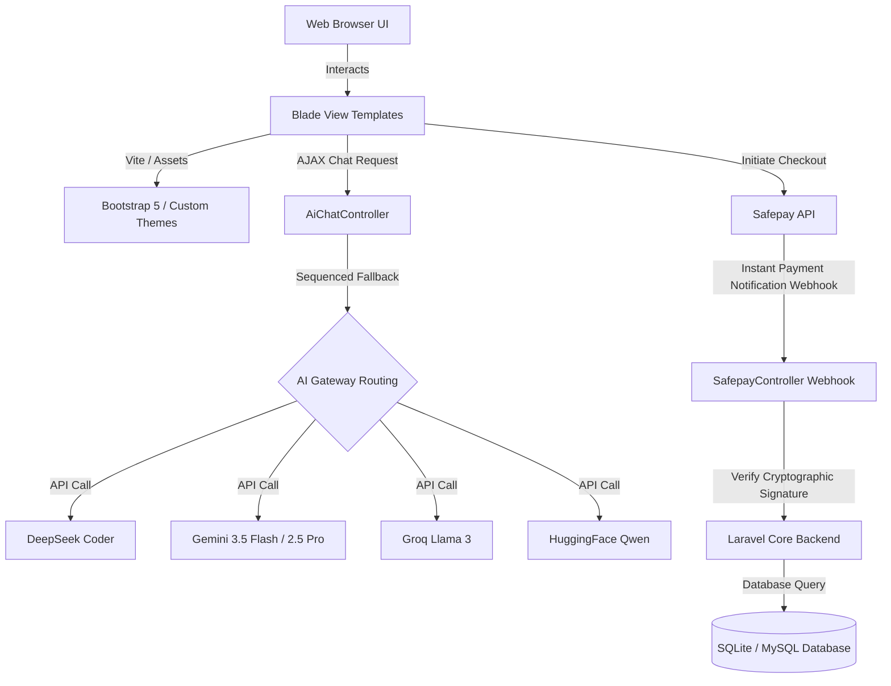

# 🏥 Doctor Appointment System (DAS) with Cura AI

[](https://laravel.com)
[](https://php.net)
[](https://getbootstrap.com)
[](#-cura-ai-chatbot)
[](https://getsafepay.com)

A premium, production-ready clinic management and patient appointment booking platform built on **Laravel 12.0** and **PHP 8.2**. It features role-based dashboards, a multi-theme engine supporting 8 custom styles, online payments with webhook verification, real-time notifications, a custom dynamic CMS, and a state-of-the-art **AI Assistant ("Cura AI")** that registers patients and schedules appointments using natural language.

---

## 🌟 Key Features

### 👤 Role-Based Management & Dashboards
*   **Patients**:
    *   Dynamic dashboard showing upcoming appointments and medical history.
    *   Online appointment scheduling with real-time slot checking.
    *   Secure online payments via Safepay (Sandbox & Production support).
    *   Access to prescription records and print-ready options.
*   **Doctors**:
    *   Personalized metrics dashboard (Pending, Approved, and Checked consultations).
    *   Weekly schedule constructor & dynamic slot duration settings.
    *   Leave calendar management via **Blocked Dates**.
    *   Digital **Prescription Writer** with active ingredient lists, dosage details, and print options.
    *   Comprehensive access to patient medical histories.
*   **Receptionists**:
    *   Quick patient verification check (by CNIC) and new patient registration.
    *   Appointment booking panel for walk-in patients.
    *   Billing and fee collection ledger (both cash and digital tracking).
    *   **Patient Vitals Desk**: Log temperature, blood pressure, pulse, and weight prior to doctor checkups.
    *   Automated refund trigger for cancelled appointments.
*   **Administrators**:
    *   Full platform telemetry showing doctor stats, patient growth, and revenue.
    *   Manage specialties/categories, doctors, and receptionist profiles.
    *   Manage clinic website settings, custom banners, social media links, and operating hours.
    *   **Interactive Theme Switcher**: Change typography and choose between 8 HSL-driven UI color themes.
    *   **CMS Module**: Create and manage dynamic custom pages (e.g., About Us, dynamic policies) directly from the dashboard.

### 🤖 Cura AI Chatbot (Smart Assistant)
Cura AI is a modern, floating glassmorphic chat assistant embedded on the front page. Powered by advanced LLMs with active **Function Calling (Tools)**, it interacts with patients naturally to:
*   **List specialties** (`list_specialties` tool).
*   **Search for doctors** (`search_doctors` tool) based on name or category.
*   **Check slot availability** (`get_doctor_slots` tool) dynamically for any specific date.
*   **Book appointments** (`book_appointment` tool) instantly for logged-in patients.
*   **Register & Book in a single flow** (`register_and_book` tool) for guest patients by collecting their Full Name, Mobile Number, and 13-digit CNIC.
*   **Fetch Patient Records** (`get_patient_history` tool) when a patient enters their unique MR Number.
*   **Failover Resilient Routing**: Cura AI will dynamically cycle through your configured API keys (DeepSeek, Gemini series, Groq, HuggingFace) to prevent outages if a provider goes offline.

### 🎨 Premium UI & Theming System
The admin can swap the color profile of the entire application instantly. The project includes high-fidelity CSS styling sheets tailored for 8 premium themes:
1.  **Luxury Gold** (`luxury_gold`): Dark backgrounds with premium gold accents.
2.  **Modern Dark** (`modern_dark`): Clean, futuristic dark mode.
3.  **Nature Green** (`nature_green`): Calming, organic medical look.
4.  **Ocean Blue** (`ocean_blue`): Classic, professional healthcare theme.
5.  **Royal Purple** (`royal_purple`): Rich, sophisticated aesthetic.
6.  **Soft Rose** (`soft_rose`): Warm, comforting tones.
7.  **Sunset Orange** (`sunset_orange`): High energy, modern warm palette.
8.  **Default** (`clean_minimal`): Sleek and minimal white/indigo template.

---

## 🛠️ Technology Stack & Architecture



*   **Frontend**: Laravel Blade, Vanilla CSS (with responsive grid & HSL variables), Bootstrap 5, Font Awesome 6, Google Fonts (Inter, Outfit, Roboto).
*   **Backend**: Laravel 12.0, PHP 8.2.
*   **Database**: SQLite (default configuration) or MySQL.
*   **Payments**: Safepay SDK (`getsafepay/sfpy-php`) for merchant gateways, callback redirects, webhook verifications, and automated refunds.
*   **Notifications**: Laravel Database Notification Driver.

---

## 🔐 Credentials & Authentication Flows

The system uses two separate login paradigms to streamline accessibility:

### 1. Patient Access (Passwordless CNIC + MR Login)
Patients do not use a standard password to log in. Instead, their credentials are:
*   **Username / ID**: 13-digit CNIC (numbers only, e.g., `3630212345678`).
*   **Password / MR Number**: Unique Medical Record Number generated during registration (format: `MR-YYYYMM-XXXX`, e.g., `MR-202606-0001`).

### 2. Staff Access (Standard Email + Password)
Admin, Doctors, and Receptionists log in using their email and password.
*   **Default Admin Account** (seeded automatically):
    *   **Email**: `admin@gmail.com`
    *   **Password**: `admin121`

---

## ⚙️ Setup & Installation

Follow these instructions to run the project in your local development environment:

### 1. Configure the Environment File
Copy the example environment settings to create your local `.env` configuration file:
```bash
cp .env.example .env
```

### 2. Run the Automatic Setup Script
The project includes a pre-configured installation script in `composer.json` to handle all dependencies, DB setups, key generation, and frontend asset compilation:
```bash
composer run setup
```
*This command runs `composer install`, creates `.env`, generates the application key, creates/runs migrations, installs npm dependencies, and builds production-ready assets.*

### 3. Seed Default Records
Generate the default administrator and basic clinic configurations:
```bash
php artisan db:seed --class=AdminSeeder
php artisan db:seed --class=SettingsSeeder
```

### 4. Run the Development Server
Launch the PHP development server, Vite dev compiler, queue listener, and diagnostic log streams in a single concurrent task:
```bash
composer run dev
```
*This automatically boots up the application on `http://localhost:8000`.*

---

## 🤖 AI Chatbot Configuration

To enable the Cura AI Chatbot, configure your desired LLM API credentials in your `.env` file. You can define multiple keys; the system will prioritize deepseek and fail over to other active APIs sequentially:

```env
# DeepSeek API Configuration (Default Priority 1)
DEEPSEEK_API_KEY=your_deepseek_api_key_here

# Google Gemini API Configuration (Priority 2)
GEMINI_API_KEY=your_gemini_api_key_here

# Groq API Configuration (Priority 3)
GROQ_API_KEY=your_groq_api_key_here

# HuggingFace API Configuration (Priority 4)
HUGGINGFACE_API_KEY=your_huggingface_api_key_here
```

*Provider priority routing is fully adjustable in [config/ai.php](file:///config/ai.php).*

---

## 💳 Safepay Payment Integration

To support online payments, set up your Safepay sandbox keys in your `.env`:

```env
SAFEPAY_API_KEY=your_safepay_sandbox_api_key
SAFEPAY_API_SECRET=your_safepay_sandbox_api_secret
SAFEPAY_WEBHOOK_SECRET=your_safepay_webhook_secret
SAFEPAY_ENVIRONMENT=sandbox # Set to 'production' for live payments
```

### Webhook Verification
For real-time confirmation of online payments, expose your local port (using `ngrok` or similar) and register the webhook URL:
```text
https://your-public-url.ngrok-free.app/safepay/webhook
```
The endpoint validates incoming payload signatures using `SAFEPAY_WEBHOOK_SECRET` to prevent payment spoofing.

---

## 📂 Key Directory Layout

*   [app/Http/Controllers/](file:///app/Http/Controllers/): Core backend controllers.
    *   [AiChatController.php](file:///app/Http/Controllers/AiChatController.php): Chatbot logic, context feeding, failover provider loops, and LLM tool execution.
    *   [SafepayController.php](file:///app/Http/Controllers/SafepayController.php): Webhook callback processing.
    *   [AdminController.php](file:///app/Http/Controllers/AdminController.php): Telemetry reports, dynamic pages CMS, category, and staff settings.
*   [config/](file:///config/): Application configurations.
    *   [ai.php](file:///config/ai.php): LLM model configurations and API gateways fallback order.
*   [resources/views/](file:///resources/views/): Blade templates.
    *   [themes/](file:///resources/views/themes/): Style modules split into clean, gold, dark, rose, green, purple, and orange themes.
    *   [layouts/ai_bot.blade.php](file:///resources/views/layouts/ai_bot.blade.php): Floating chat assistant frontend layout and script handler.
*   [database/migrations/](file:///database/migrations/): Database tables and fields.

---

## 📄 License
This project is licensed under the MIT License. See [LICENSE](file:///LICENSE) for details.
